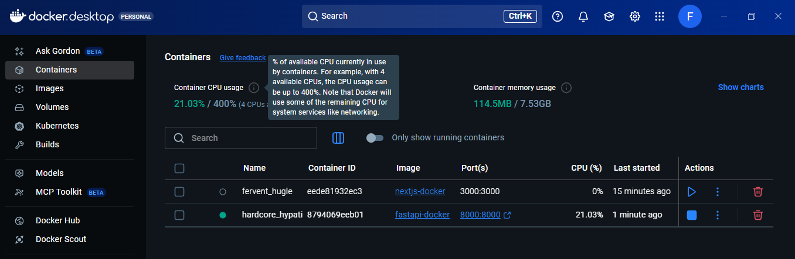
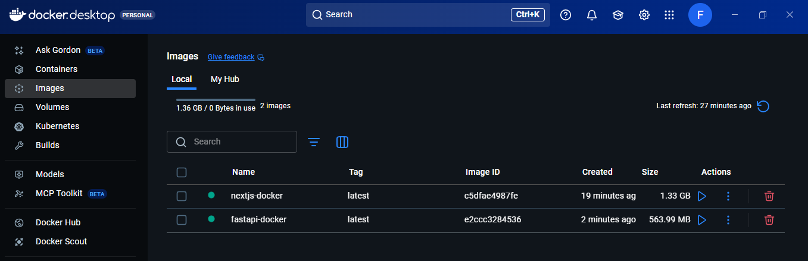

# Docker Containerization Assignment

This repository contains two simple Dockerized projects:

1. **Next.js Docker Project** (`nextjs-docker`)  
2. **FastAPI Docker Project** (`fastapi-docker`)  

Both projects demonstrate how to create **Docker images** and run **containers**.

---

## Next.js Docker Project

**Overview:**  
A simple Next.js app containerized with Docker.

**Run:**

```bash
cd nextjs-docker
docker build -t nextjs-app .
docker run -p 3000:3000 nextjs-app

Open http://localhost:3000
```

**Screenshot:**




-----------------------------------------------



## FastAPI Docker Project

**Overview:** 
A simple FastAPI app containerized with Docker.

**Run:**

```bash
cd fastapi-docker
docker build -t fastapi-app .
docker run -p 8000:8000 fastapi-app

Open http://localhost:8000/docs
```

**Screenshot:**


----------------------------------------------

